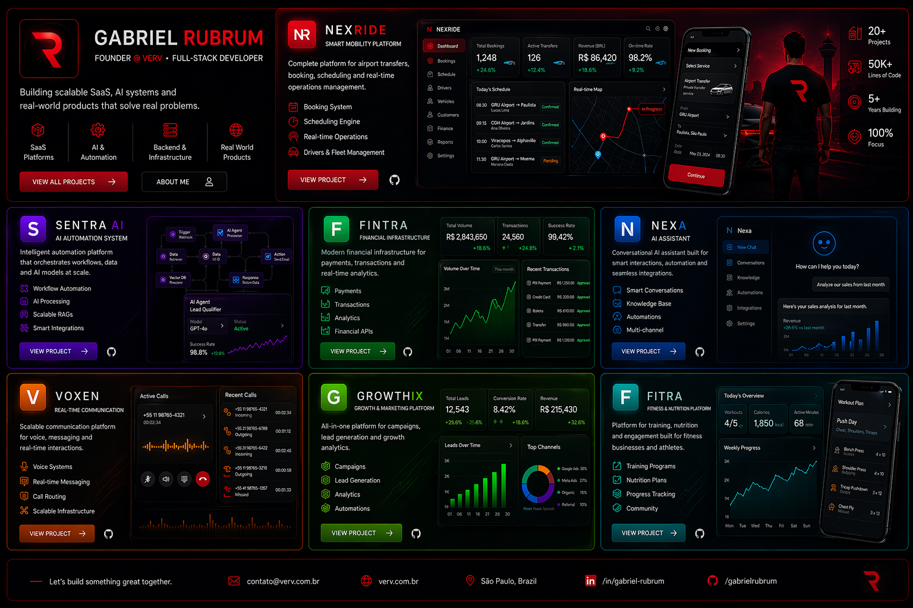

  

# Gabriel Rubrum

  

  <b>Full-Stack Developer • Founder @ Verv</b>

  
  
  
  

---

## 🧠 About

I build **real-world platforms** focused on performance, scalability and product-oriented architecture.

- SaaS systems  
- AI-powered applications  
- Web & mobile development  
- Backend & infrastructure  
- Automation & integrations  

---

## 🚀 Featured Projects

<table>
  <tr>
    <td width="50%">
      
      <h3>✈️ Nexrice</h3>
      
Airport transfer platform with booking, scheduling and real-time operations.

      
<a href="https://github.com/gabrielrubrum/nexrice">View Repository</a>

    </td>
    <td width="50%">
      
      <h3>🤖 AI Platform</h3>
      
Automation system with intelligent workflows and scalable architecture.

      
<a href="https://github.com/gabrielrubrum/ai-platform">View Repository</a>

    </td>
  </tr>

  <tr>
    <td width="50%">
      
      <h3>🧠 AI Assistant</h3>
      
Smart assistant for automation and user interaction.

      
<a href="https://github.com/gabrielrubrum/ai-assistant-platform">View Repository</a>

    </td>
    <td width="50%">
      
      <h3>📡 VOIP Platform</h3>
      
Real-time communication system with scalable backend.

      
<a href="https://github.com/gabrielrubrum/voip-platform">View Repository</a>

    </td>
  </tr>

  <tr>
    <td width="50%">
      
      <h3>🍕 Pizer</h3>
      
Food ordering platform with admin panel and payment-ready structure.

      
<a href="https://github.com/gabrielrubrum/pizer-app">View Repository</a>

    </td>
    <td width="50%">
      
      <h3>💰 Financial Horizon</h3>
      
Financial system for transactions, analytics and backend operations.

      
<a href="https://github.com/gabrielrubrum/financial-horizon">View Repository</a>

    </td>
  </tr>

  <tr>
    <td width="50%">
      
      <h3>🎯 Marketing Platform</h3>
      
Platform for campaigns, leads and marketing automation.

      
<a href="https://github.com/gabrielrubrum/marketing-platform">View Repository</a>

    </td>
    <td width="50%"></td>
  </tr>
</table>

---

## 🧰 Tech Stack

  

---

## 📊 GitHub Stats

---

## 🎯 Focus

- SaaS platforms  
- AI systems  
- Backend performance  
- Real-world applications  

---

🌐 https://verv.com.br  
📩 contato@verv.com.br  

---

🔥 Building real products. Not just code.

